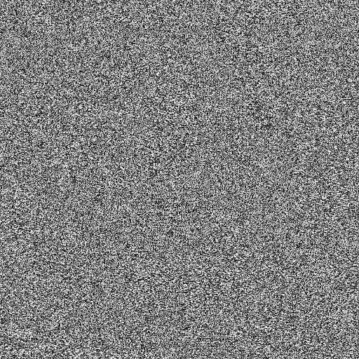
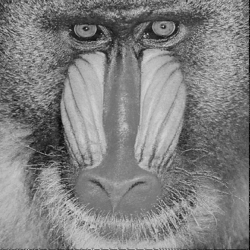
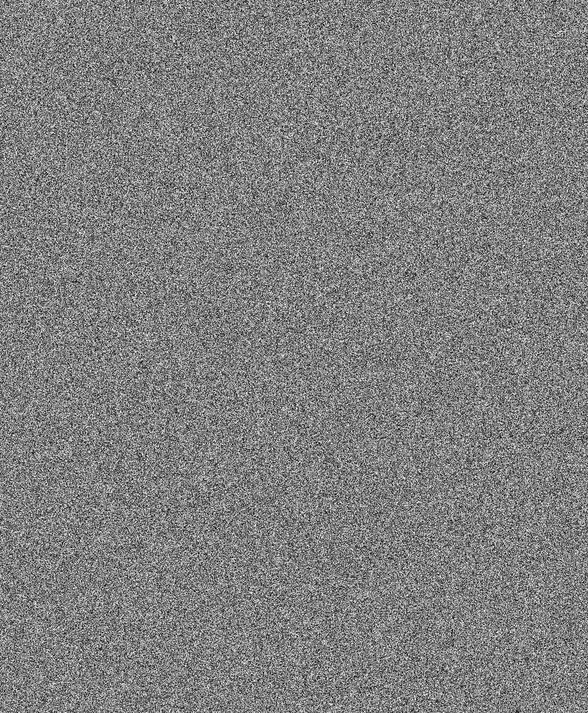
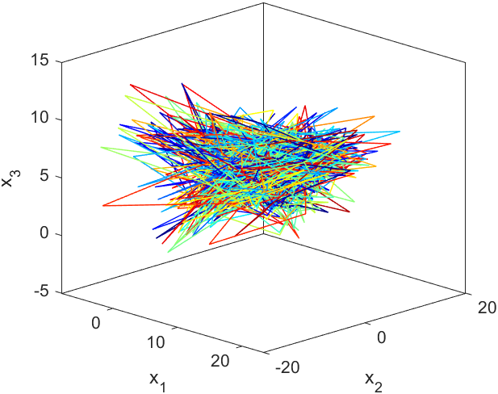
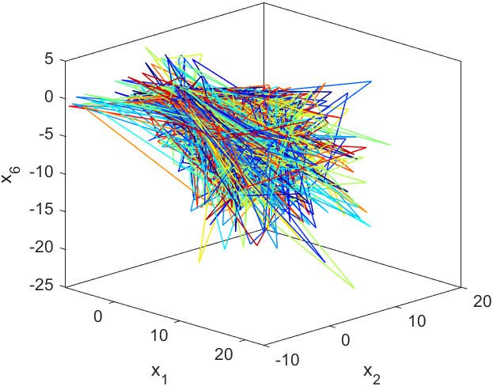
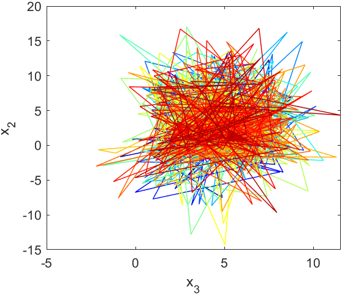
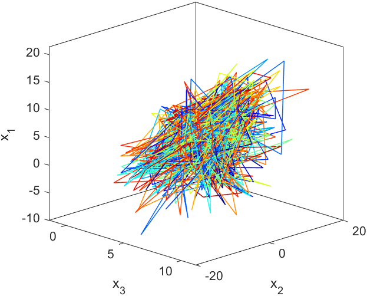
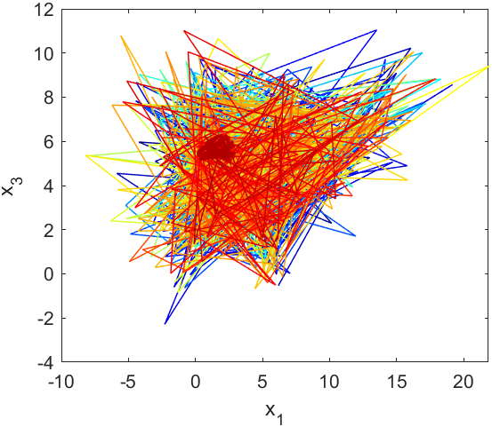
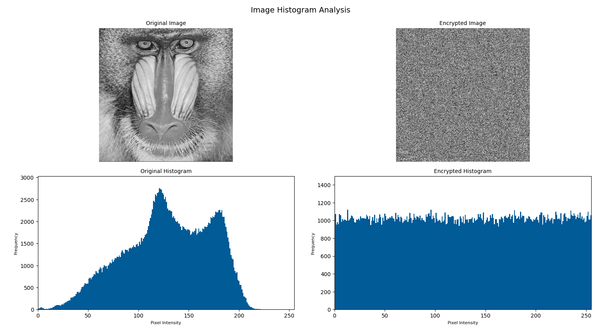
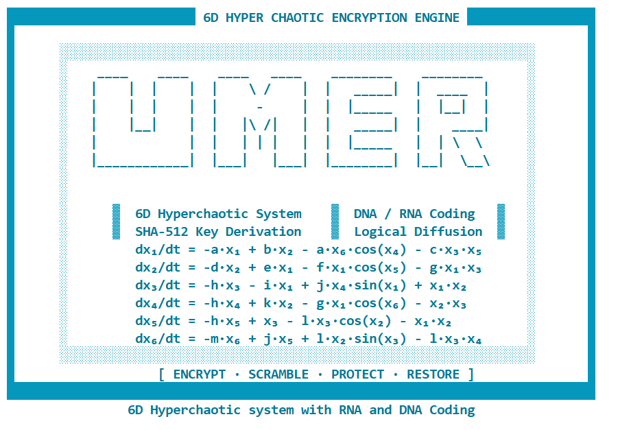

# 🔐 A Novel Hyperchaotic (6D) Genomic Cipher for Image Encryption 

This repository presents a *chaos-based image encryption algorithm* that combines *hyperchaotic dynamics* and *bio-inspired coding schemes* for robust image protection.  
The scheme is designed to resist brute-force, statistical, and differential attacks, making it highly suitable for *secure multimedia communication*.

---

## 🚀 Features
- *6D Hyperchaotic System*  
  - Generates highly complex and unpredictable chaotic sequences.  
  - Provides strong key sensitivity and large key space.  

- *DNA & RNA Coding*  
  - Implements multiple DNA and RNA encoding/decoding rules.  
  - Enhances confusion and diffusion through bio-inspired logical operations.  

- *Scrambling Mechanisms*  
  - *Block-level scrambling*  for block permutation.  
  - *Pixel-level scrambling* for finer pixel shuffling.  

- *Diffusion Process*  
  - Ensures avalanche effect: a single-bit change in plaintext leads to significant cipher changes.  

- *Chaotic Shift (Rolling Function)*  
  - A final layer of pixel shifting using chaotic sequences for additional randomness.  

---

## 📊 Security Analysis
The proposed encryption algorithm has been evaluated using standard cryptographic measures:  
- *NPCR (Number of Pixel Change Rate)*  
- *UACI (Unified Average Changing Intensity)*  
- *Entropy Analysis*  
- *Correlation Coefficient*  
- *Histogram Uniformity*  
- *Key Space & Key Sensitivity*  

---

## 🖼 Example Results

| Original Image | Encrypted Image | Decrypted Image |
|----------------|----------------|----------------|
|  |  |  |
|  |  |  |

---

## 🖼 Phase Potrate of 6D Hyperchaotic system (MATLAB R2024a)

| 3D representation | 3D representation | 2D representation |
|----------------|----------------|----------------|
|  |  |  |
|  |  |  |


---

## 📊 Histogram Analysis


---

## 🎯 OUTPUT RESULT
  
 


---

## 👨‍🎓 STUDENT


**Umer Farooq** M.Tech (Computer Science and Engineering)
Roll Number: **03MTGC23**
Department of Computer Science & Engineering
**Government College of Engineering and Technology (GCET), Jammu**


---

## 📂 Project Structure

```text
├── 6D.py # Main encryption and decryption implementation
├── utils/ # Helper functions (chaotic maps, DNA/RNA rules, scrambling, etc.)/
├── README.md # Project documentation

